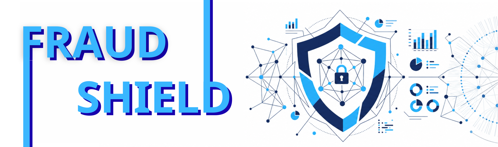

# FraudShield

FraudShield là project phát hiện gian lận giao dịch tài chính, phục vụ cho đồ án cuối kì Nhập môn Khoa học Dữ liệu. Repo này bao gồm đầy đủ từ luồng dữ liệu, feature engineering, huấn luyện mô hình, API dự đoán, giao diện Streamlit, logging prediction lên GCS, drift report với BigQuery/Evidently và manifest triển khai lên GKE. Để hiểu chi tiết hơn về quá trình hình thành của dự án, hãy xem thêm tại [Report](https://github.com/DDuckG/FraudShield/blob/main/reports/report_FraudShield.pdf)

Dữ liệu sử dụng là bộ data trên Kaggle [Fraud detection 1M transactions - 7 fraud types](https://www.kaggle.com/datasets/sergionefedov/fraud-detection-1m-transactions-7-fraud-types) với riêng `transactions.csv`. 

## Demo Video

<p align="center">
    <a href="https://www.youtube.com/watch?v=vMW7HmM4AwI">
        
    </a>
</p>

## Cấu trúc repo

```text
.
├── configs/                  # cấu hình các mô hình baseline
├── data/
│   ├── raw/                  # dữ liệu gốc
│   └── processed/            # data đã qua xử lý
├── deployment/
│   ├── k8s/                  # cáu hình cho API, drift job, monitoring và Grafana
│   └── mlflow/               # Docker Compose chạy MLflow local
├── models/
│   ├── artifacts/            # lưu encoder, scaler, label encoder dùng lúc inference
│   └── trained/              # Model đã train, metadata, cột
├── notebooks/                # các notebook phân tích
├── reports/
│   ├── training/             # Kết quả so sánh model và model tốt nhất
│   └── drift_report.html     # Drift report sinh ra khi chạy monitoring
├── src/
│   ├── api/                  # FastAPI, schema, inference, logging prediction/feedback
│   ├── data/                 # script tải data
│   ├── features/             # Feature engineering cho train + API
│   ├── model/                # Train baseline & tuning model
│   ├── monitoring/           # Metric, drift report, upload report lên GCS
│   └── streamlit/            # demo
├── dvc.yaml                  # cấu hình pipeline: feature engineering -> train -> tuning
├── params.yaml               # tham số chạy full
├── pyproject.toml            # Dependency, quản lý bằng uv
└── uv.lock
```

## Téch Stáck

- Python 3.11+
- uv
- DVC, DVC S3
- pandas, scikit-learn, LightGBM, XGBoost, CatBoost, Optuna
- MLflow
- FastAPI, Uvicorn
- Streamlit
- Evidently
- Google Cloud Storage, BigQuery, BigQuery Storage API
- Prometheus metrics, Grafana
- Docker, Kubernetes/GKE, Helm
- GitHub Actions

## Hướng dẫn set up

Clone repo về máy:

```bash
git clone git@github.com:DDuckG/FraudShield.git
cd FraudShield
```

Cài dependency. Nếu muốn làm việc đầy đủ trên repo, dùng tất cả group:

```bash
uv sync --all-groups
cp .env.example .env
```

Nếu chỉ chạy một phần, có thể sync theo vai trò:

```bash
uv sync --no-default-groups --group serve       # FastAPI inference
uv sync --no-default-groups --group train       # DVC, train, MLflow
uv sync --no-default-groups --group monitoring  # drift report
uv sync --no-default-groups --group demo        # Streamlit
```

> Nếu chỉ chạy local, có thể để trống các biến cloud trong `.env` nhưng để test đủ logging prediction, feedback và drift report, cần điền GCS/BigQuery

## Lấy data

Cách đơn giản nhất là tải từ Kaggle:

```bash
uv run --group train python src/data/get_data.py
```

Output:

```text
data/raw/transactions.csv
```

Hoặc:

```bash
uv run --group train dvc pull     # chỉ khi dev có quyền DVC remote S3
```

> Để dùng remote này cần AWS credential có quyền đọc/ghi bucket.

## Chạy MLflow

MLflow dùng để ghi experiment khi train:

```bash
cd deployment/mlflow
docker compose up -d
cd ../..
```

UI sẽ được hiển thị ở cổng `5555` nhà bạn:


```bash
cd deployment/mlflow 
docker compose down  # nếu muốn tắt
cd ../..
```

## Chạy pipeline train

Pipeline chính nằm trong `dvc.yaml`, có thể chạy bằng lệnh:

```bash
uv run --group train dvc repro

# Kiểm tra trạng thái pipeline:
uv run --group train dvc status
```

Output chính sẽ bao gồm:

```text
data/processed/*.parquet
reports/training/baseline_leaderboard.csv
reports/training/best_model.json
models/artifacts/*.pkl
models/trained/trained_model.pkl
models/trained/model_columns.pkl
models/trained/trained_model_meta.json
models/trained/tuning_pr_auc_by_trial.png
```

Sau khi train lại và muốn đẩy artifact lên DVC remote (như đã nói, cần quyền, chủ yếu phục vụ dev, not demo):

```bash
uv run --group train dvc push
```

## Chạy API

API cần model artifact trong `models/trained` và `models/artifacts`. Nếu chưa có, chạy `uv run --group train dvc pull` hoặc `uv run --group train dvc repro` trước. Sau đó, chạy tiến trình API ở riêng một terminal:

```bash
uv run --group serve uvicorn src.api.main:app --host 0.0.0.0 --port 8000
```

Endpoint chính bao gồm:

- `GET /health`: kiểm tra model đã nạp chưa
- `POST /predict`: dự đoán một giao dịch
- `POST /batch`: dự đoán nhiều giao dịch
- `POST /feedback`: ghi nhãn thực tế sau review
- `GET /metrics`: Prometheus metrics
- `GET /docs`: Swagger UI để xem chi tiết docs

Predict thử một giao dịch:

```bash
curl -X POST http://localhost:8000/predict \
  -H "Content-Type: application/json" \
  -d '{
    "transaction_id": "TX_DEMO_001",
    "user_id": "USER_DEMO",
    "hour_of_day": 2,
    "day_of_week": 5,
    "is_weekend": 1,
    "amount": 250.0,
    "card_present": 0,
    "device_known": 0,
    "is_foreign_txn": 1,
    "has_2fa": 0,
    "time_since_last_s": 120.0,
    "velocity_1h": 4.0,
    "amount_vs_avg_ratio": 2.5,
    "account_age_days": 120,
    "credit_limit": 5000.0,
    "merchant_category": "electronics",
    "merchant_country": "US",
    "device_type": "mobile_app",
    "mcc_code": 5732,
    "ip_risk_score": 72.0
  }'
```

## Chạy Streamlit

Mở API trước, sau đó chạy:

```bash
FRAUD_API_URL=http://localhost:8000 uv run --group demo streamlit run src/streamlit/app.py
```

Streamlit chỉ là giao diện nhập liệu. Logic dự đoán vẫn chạy qua FastAPI.

## Cấu hình GCS và BigQuery

API lưu prediction và feedback thành Parquet trên GCS:

```text
gs://<GCS_BUCKET_NAME>/predictions/dt=YYYY-MM-DD/hour=HH/*.parquet
gs://<GCS_BUCKET_NAME>/feedbacks/dt=YYYY-MM-DD/hour=HH/*.parquet
```

Drift report được lưu tại:

```text
gs://<GCS_BUCKET_NAME>/drift-reports/archive/...
gs://<GCS_BUCKET_NAME>/drift-reports/latest/drift_report.html
```

Các biến cần điền trong `.env`:

```bash
PROJECT_ID=<gcp-project-id>
GCS_BUCKET_NAME=<bucket-name>
BQ_DATASET=fraud_shield_monitoring
REFERENCE_DATA_PATH=data/raw/transactions.csv
PERSISTENCE_MODE=best_effort
```

Tạo bucket và dataset:

```bash
gcloud config set project <PROJECT_ID>
gcloud storage buckets create gs://<GCS_BUCKET_NAME> --location=asia-southeast1
bq --location=asia-southeast1 mk --dataset <PROJECT_ID>:fraud_shield_monitoring
```

Service account chạy API/drift job cần các quyền tối thiểu:

- `roles/storage.objectAdmin`
- `roles/bigquery.jobUser`
- `roles/bigquery.dataViewer`

Drift job query bảng hoặc view:

```text
<PROJECT_ID>.<BQ_DATASET>.predictions_ext
```

Bảng/view này cần đọc được các file Parquet prediction trong GCS. Sau khi API đã ghi một số prediction, chạy drift report:

```bash
uv run --group monitoring python -m src.monitoring.run_drift_report
```

Output local:

```text
reports/drift_report.html
```

## Docker

```bash
docker build -t fraudshield-api:local .                                # để build image
docker run --rm -p 8000:8000 --env-file .env fraudshield-api:local     # chạy container
curl http://localhost:8000/health                                      # check
```

> <u>Lưu ý</u>: image cần có model artifact và `data/raw/transactions.csv` nếu dùng cùng image để chạy drift CronJob.

## Kubernetes/GKE

Các cấu hình đặt trong `deployment/k8s`.

- `deployment.yaml`: FastAPI deployment
- `service.yaml`: LoadBalancer service
- `sa.yaml`: Kubernetes ServiceAccount cho Workload Identity
- `monitoring-cronjob.yaml`: drift report CronJob
- `pod-monitoring.yaml`: scrape `/metrics`
- `grafana/grafana-values.yaml`: cấu hình Grafana Helm chart

hiện chúng đang dùng cấu hình demo của project. Nếu dùng project khác, thay `PROJECT_ID`, bucket, service account và namespace trong các file YAML tương ứng.

Render image và deploy:

```bash
set -a
source .env
set +a

export IMAGE_REF=<dockerhub-user>/<repo>:<tag>
export GSA_EMAIL=<service-account-api@project.iam.gserviceaccount.com>
export GRAFANA_GSA_EMAIL=<service-account-grafana@project.iam.gserviceaccount.com>

envsubst < deployment/k8s/sa.yaml | kubectl apply -f -
kubectl create secret docker-registry dockerhub-secret \
  --docker-server=https://index.docker.io/v1/ \
  --docker-username=<dockerhub-user> \
  --docker-password=<dockerhub-token> \
  --dry-run=client -o yaml | kubectl apply -f -

envsubst < deployment/k8s/deployment.yaml | kubectl apply -f -
kubectl apply -f deployment/k8s/service.yaml
envsubst < deployment/k8s/monitoring-cronjob.yaml | kubectl apply -f -
kubectl apply -f deployment/k8s/pod-monitoring.yaml
```

Kiểm tra:

```bash
kubectl rollout status deployment/fraud-api-deployment
kubectl get pods -o wide
kubectl get service fraud-api-service
```

Chạy drift job thủ công:

```bash
kubectl delete job drift-report-initial --ignore-not-found=true
kubectl create job drift-report-initial --from=cronjob/drift-report-job
kubectl logs -f -l job-name=drift-report-initial
```

## Grafana

Deploy Grafana:

```bash
envsubst < deployment/k8s/grafana/grafana-sa.yaml | kubectl apply -f -

helm repo add grafana https://grafana.github.io/helm-charts
helm repo update

envsubst < deployment/k8s/grafana/grafana-values.yaml > /tmp/fraudshield-grafana-values.yaml
helm upgrade --install grafana grafana/grafana \
  -n default \
  -f /tmp/fraudshield-grafana-values.yaml \
  --set adminPassword="<admin-password>"
```

Kiểm tra:

```bash
kubectl get service grafana
```

## GitHub Actions

Workflow trong `.github/workflows`:

- `ci.yaml`: cài dependency, kiểm tra DVC graph, compile source, chạy pytest
- `ct.yaml`: pull DVC, train full pipeline, push artifact, commit report/model metadata
- `cd.yaml`: build/push Docker image, deploy GKE, chạy drift job, apply monitoring/Grafana

Secret cần có:

| Secret | Dùng cho |
| --- | --- |
| `LOCAL_AWS_ACCESS_KEY_ID` | DVC S3 |
| `LOCAL_AWS_SECRET_ACCESS_KEY` | DVC S3 |
| `S3_BUCKET_NAME` | Thông tin bucket S3 |
| `TEST_DOCKERHUB_USERNAME` | Docker Hub |
| `TEST_DOCKERHUB_REPO` | Docker Hub repo |
| `TEST_DOCKERHUB_TOKEN` | Docker Hub token |
| `WIF_PROVIDER` | GitHub Actions -> Google Cloud |
| `WIF_SERVICE_ACCOUNT` | Service account deploy |
| `PROJECT_ID` | GCP project dùng để render manifest |
| `GCS_BUCKET_NAME` | Bucket lưu prediction, feedback, drift report |
| `GKE_CLUSTER_NAME` | Tên GKE cluster |
| `GCP_REGION` | Region GKE |
| `GRAFANA_GSA_EMAIL` | Service account cho Grafana, có quyền đọc Monitoring/BigQuery |
| `GRAFANA_ADMIN_PASSWORD` | Mật khẩu admin Grafana |
